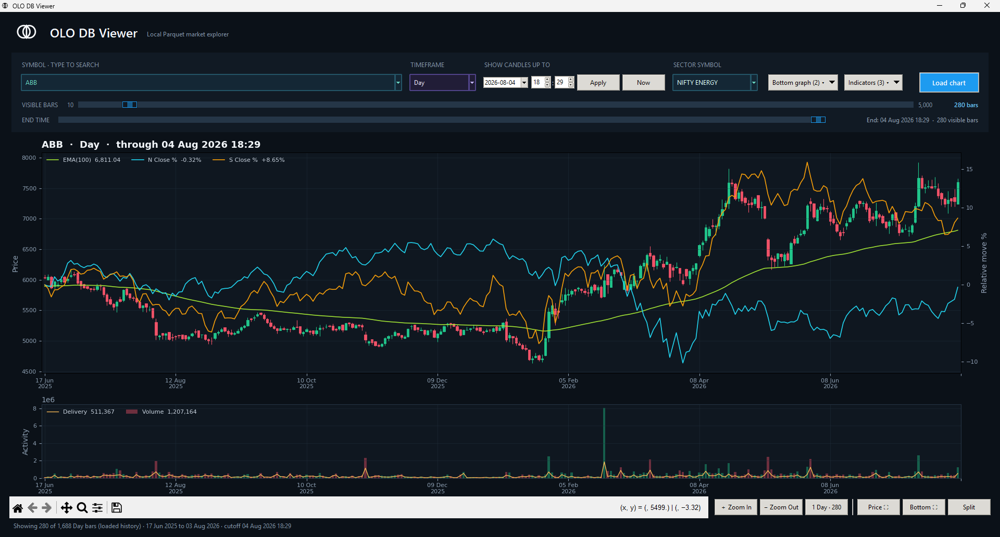

# NSE India Multi-Timeframe TL Data in Parquet



> [!NOTE]
> The image above is a temporary interface placeholder copied from the related OLO database project. Replace it with a TL-specific viewer capture at the same path; all documentation links will remain valid.

Open, query-ready **NSE India daily OHLCV and multi-timeframe TL dataset** organized as one Parquet file per symbol. Each local file combines daily market candles with Daily, Weekly, Monthly, and Quarterly TL values in both standard and OHLC-derived forms.

This repository is designed for technical-level research, chart overlays, screening, DuckDB and pandas analysis, backtesting inputs, data engineering, machine learning, and reproducible educational examples.

> [!IMPORTANT]
> This is an independent community project. It is not affiliated with, endorsed by, or operated by the National Stock Exchange of India. The dataset is provided for research and education, not investment advice. Validate the data, indicator interpretation, and source rights before production use.

## What is included

- One `tl.parquet` file per qualifying symbol.
- Daily OHLCV columns for charting and validation.
- Daily, Weekly, Monthly, and Quarterly TL values.
- Parallel `*_tl_ohlc` values derived from OHLC-oriented inputs upstream.
- Symbol-partitioned storage for fast single-instrument reads.
- Incremental and full Citus/PostgreSQL-to-Parquet export tooling.
- A repository-local **OLO DB Viewer** configured exclusively for this repository's `database/` directory.

Common discovery terms: NSE technical levels dataset, NSE TL data, Indian stock market support resistance data, NSE daily OHLCV Parquet, weekly monthly quarterly technical levels, DuckDB NSE indicators, pandas Indian equities data, and multi-timeframe stock levels.

## Documentation index

| Resource | Purpose |
| --- | --- |
| [File structure](docs/FILE_STRUCTURE.md) | Symbol directories, `tl.parquet`, and internal build paths |
| [Data dictionary](docs/DATA_DICTIONARY.md) | Source-mirrored schema and common TL field definitions |
| [Quick start](docs/QUICKSTART.md) | DuckDB, Python, pandas, and Polars examples |
| [Data quality](docs/DATA_QUALITY.md) | Validation SQL, assumptions, and limitations |
| [FAQ](docs/FAQ.md) | Direct answers for developers, search engines, and AI tools |
| [Discoverability guide](docs/DISCOVERABILITY.md) | Search, AI indexing, GitHub topics, and release guidance |
| [LLM index](llms.txt) | Compact machine-readable repository map |
| [Dataset metadata](metadata/dataset.jsonld) | Schema.org JSON-LD dataset description |
| [Parquet schema](metadata/parquet-schema.json) | Machine-readable ordered column contract |
| [Citation metadata](CITATION.cff) | How to cite the dataset and exporter |
| [Contributing](CONTRIBUTING.md) | Validation, docs, exporter, and viewer contributions |
| [Exporter configuration](scripts/config.example.json) | Citus source and local output settings |

## Repository layout

```text
olo-testdata-nse-tl-data/
├── database/
│   ├── a/ABB/tl.parquet
│   ├── r/RELIANCE/tl.parquet
│   └── _temp/                         # optional DuckDB spill directory
├── scripts/
│   ├── export_citus_to_parquet.py     # streaming exporter
│   ├── config.example.json            # safe configuration template
│   ├── run.ps1
│   └── run.bat
├── olo-db-viewer/                     # repository-local TL database checker
├── olo-viewer/                        # reserved future viewer location
├── docs/
├── create.bat                         # rebuild all local symbol files
├── incremental.bat                    # append newer source rows
└── olo-db-viewer.bat                  # launch the local viewer
```

## Parquet schema

Each `tl.parquet` mirrors every column returned by the configured source table
for that equity. Column names and order are verified against the database
projection before the file is installed. The standard source currently
includes fields such as:

```text
daily_tl, daily_tl_ohlc,
weekly_tl, weekly_tl_ohlc,
monthly_tl, monthly_tl_ohlc,
quarterly_tl, quarterly_tl_ohlc,
candle_datetime,
daily_open, daily_high, daily_low, daily_close, daily_volume
```

Additional source columns are exported automatically without an exporter code
change. `candle_datetime` is normalized to `TIMESTAMP` while retaining its
exact name and source position. See the [data dictionary](docs/DATA_DICTIONARY.md).

> [!NOTE]
> This repository does **not** contain deliverable quantity or delivery-percentage columns. Do not infer delivery statistics from `daily_volume`; delivery data belongs to a separate dataset.

Physical row order is not guaranteed unless an export configuration explicitly sorts it. Consumers should use `ORDER BY candle_datetime`.

## Query one symbol

```sql
SELECT
  candle_datetime,
  daily_open,
  daily_high,
  daily_low,
  daily_close,
  daily_volume,
  daily_tl,
  weekly_tl,
  monthly_tl,
  quarterly_tl
FROM read_parquet('database/r/RELIANCE/tl.parquet')
ORDER BY candle_datetime;
```

## Download a packaged release

GitHub releases publish the complete `database/` tree as bounded ZIP parts.
Extract every `NSE-TL-Parquet-part-*.zip` into the same destination; each part
retains paths such as `database/r/RELIANCE/tl.parquet`.

Each release also provides `RELEASE_MANIFEST.json` and `SHA256SUMS.txt` for
file counts, part metadata, and integrity verification. Versioned releases are
created manually. The `nse-tl-latest` rolling pre-release is refreshed by a
commit whose message starts with `RC:`.

Python with DuckDB:

```python
import duckdb

levels = duckdb.sql("""
    SELECT *
    FROM read_parquet('database/r/RELIANCE/tl.parquet')
    ORDER BY candle_datetime
""").df()

print(levels.tail())
```

More recipes are available in [docs/QUICKSTART.md](docs/QUICKSTART.md).

## Open OLO DB Viewer

On Windows, double-click `olo-db-viewer.bat` in the repository root. This copy of OLO DB Viewer reads only `database/*/*/tl.parquet` from this repository and exposes the stored Daily, Weekly, Monthly, and Quarterly TL/TL-OHLC series as chart overlays.

## Configure the exporter

Copy the safe template to the ignored local configuration:

```powershell
Copy-Item .\scripts\config.example.json .\scripts\config.json
```

Set the Citus coordinator connection through the environment variables named by the configuration:

```powershell
$env:CITUS_HOST = "citus-coordinator.example.com"
$env:CITUS_PORT = "5432"
$env:CITUS_DATABASE = "market_data"
$env:CITUS_USER = "readonly_exporter"
$env:CITUS_PASSWORD = "..."
```

Credentials are not printed and `scripts/config.json` is ignored. Use a database role limited to `CONNECT`, schema `USAGE`, and source-table `SELECT`.

## Build and update

Full local recreation:

```bat
create.bat
```

Incremental export using `candle_datetime` as the watermark:

```bat
incremental.bat
```

Offline validation of completed Parquet files:

```powershell
.\scripts\run.ps1 -VerifyOnly
```

The exporter processes one equity at a time, streams through DuckDB's PostgreSQL extension, writes a temporary Parquet, verifies it, and atomically replaces `tl.parquet`. Existing completed symbols can be skipped or incrementally extended.

## Contributing

Helpful contributions include reproducible validation reports, query recipes, documentation corrections, exporter tests, cross-platform launchers, and improvements to the local TL viewer. See [CONTRIBUTING.md](CONTRIBUTING.md). Do not commit credentials or private database configuration.

## License and attribution

Repository code is covered by [LICENSE](LICENSE). Dataset/source rights may be separate; verify them before redistribution. Cite the repository URL and record the Git commit or release used for reproducibility.
